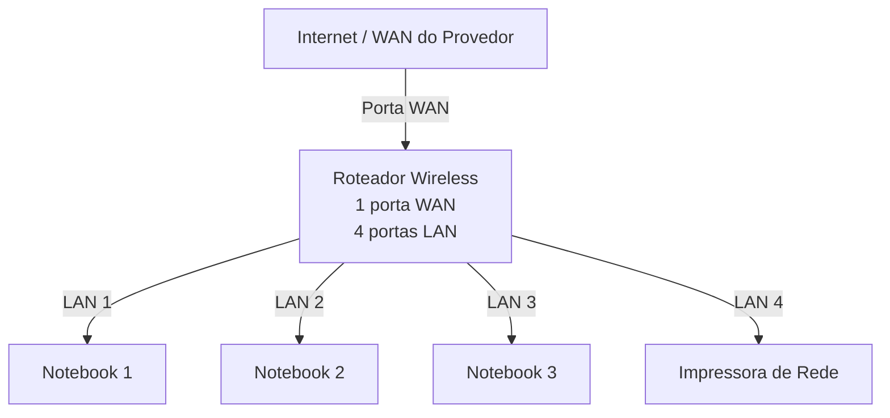
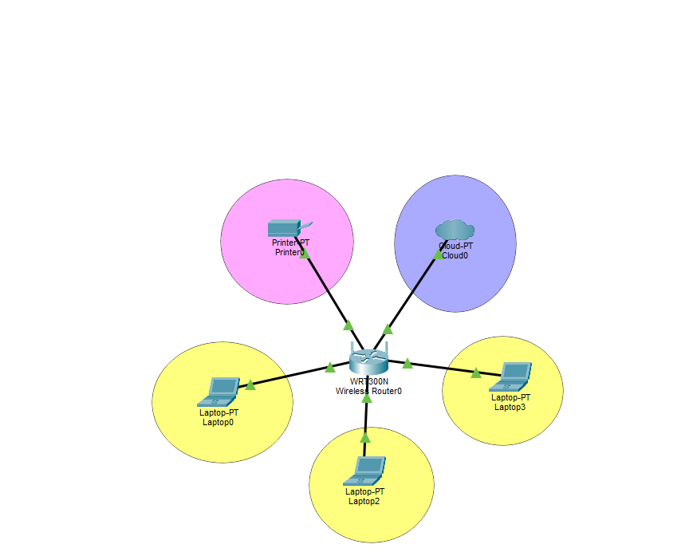

# Laboratório de Redes 01 - Projeto de Rede Local

Projeto desenvolvido na disciplina de Redes de Computadores no curso técnico de informática do SENAC.

Aluno: Leandro Gusmão  
Professor: José de Assis  
Data: 09/03/2026

---

## 1. Objetivo

Implementar uma rede local simples conectando 3 notebooks a um roteador wireless com switch integrado e uma impressora de rede.

O projeto será realizado em duas etapas:

1. Simulação da rede no Cisco Packet Tracer
2. Implementação da rede no laboratório real

---

## 2. Equipamentos utilizados neste laboratório

- 3 notebooks
- 1 roteador wireless com 1 porta WAN e 4 portas LAN
- 1 impressora de rede
- cabos de rede

---

## 3. Topologia da rede

Diagrama lógico da rede utilizada neste laboratório

## 4. Plano de endereçamento IP

Rede: 192.168.0.0/24
Gateweay 192.168.0.1

| Dispositivo| Tipo de IP| Endereço| Observação|
|------------|-------------|-------------|-------------|
|Roteador| Estático| 192.168.0.1| IP do roteador|

